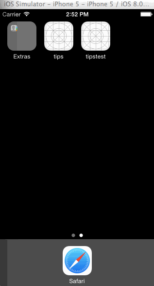

Tips
====

(Tip calculator app for first Swift class project. My app is called "Tipper".)

This is a tip calculator application for iPhones running on iOS7 or higher. It allows users to calculate the total of their bills 
based on the bill amount plus the amount of tip, which can be 15%, 20%, or 25% of the bill amount.

Time Spent: 2.5 hours total (ran into issues with the first try, and had to re-start).

* [x] Required: Clicking on text field pulls up keyboard, which is a decimal pad
* [x] Required: Clicking anywhere on screen removes keyboard
* [x] Required: Users can select different percentage options (by using segmented controls) and see the total calculated automatically
* * [x] Required: Gif walkthrough of the app

